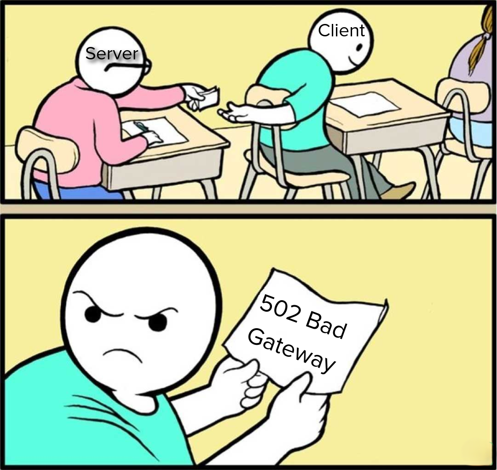
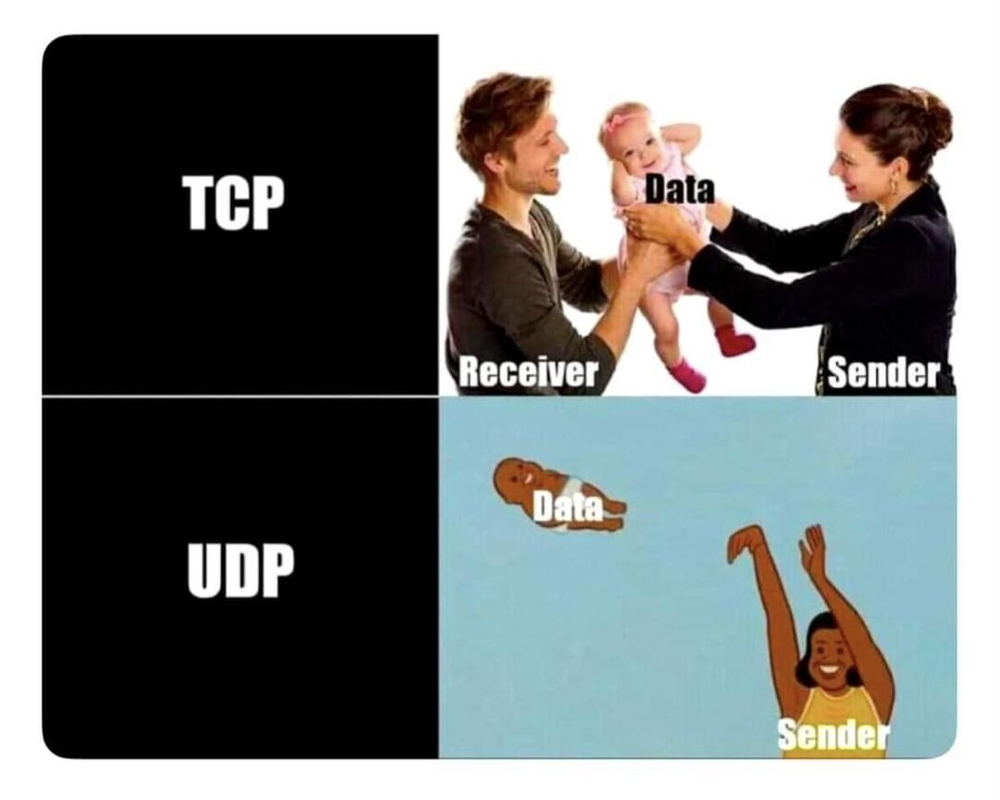

## Client-Server Architecture in a Nutshell

  

<i>Client: sends request. Server: chooses violence.</i>

 

  

<b>TCP:</b> "Hey, did you get all the packets? I'll wait for your confirmation."

<b>UDP:</b> "Packets sent! Delivery is not my problem."

